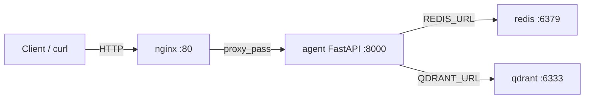

# Day 12 Lab - Mission Answers

> **Student Name:** Lê Huy Hồng Nhật
> **Student ID:** 2A202600099
> **Date:** 17/04/2026

---

## Part 1: Localhost vs Production

### Exercise 1.1: Anti-patterns found

Đọc file `01-localhost-vs-production/develop/app.py`, tìm được **7 vấn đề**:

1. **Hardcoded secrets**: `OPENAI_API_KEY`, `DATABASE_URL` bị viết trực tiếp vào code — dễ lộ khi commit lên Git/GitHub.
2. **Debug mode enabled**: `DEBUG=True` và `reload=True` — không phù hợp production vì lộ stack trace và làm chậm hiệu suất.
3. **Insecure Logging**: Sử dụng `print()` thay vì structured logger, đồng thời log cả giá trị secret.
4. **Missing Health Check**: Không có endpoint `/health` — Platform (Render, Railway) không biết khi nào app cần restart.
5. **Hardcoded host**: Bind `localhost` thay vì `0.0.0.0` — container/cloud không thể nhận traffic từ bên ngoài.
6. **Hardcoded port**: Port cố định `8000` thay vì đọc từ biến môi trường `PORT`.
7. **No Graceful Shutdown**: Không xử lý tín hiệu `SIGTERM/SIGINT` — mất request đang xử lý khi scale down hoặc redeploy.

### Exercise 1.3: Comparison table

| Feature | Basic (Develop) | Advanced (Production) | Tại sao quan trọng? |
|---------|-----------------|----------------------|---------------------|
| **Config** | Hardcode trong code | Đọc từ Environment Variables | Tách biệt code và cấu hình, thay đổi môi trường không cần sửa code, tránh commit secrets |
| **Health check** | ❌ Không có | ✅ `/health` + `/ready` | Platform biết khi nào app sống/sẵn sàng để restart hoặc route traffic đúng |
| **Logging** | `print()` — lộ secret, không cấu trúc | Structured JSON logging | Dễ parse, search, alert trên hệ thống log tập trung; tránh lộ thông tin nhạy cảm |
| **Shutdown** | Đột ngột — mất request | Graceful lifecycle + SIGTERM handling | Giảm mất request, tránh corrupt state khi deploy hoặc scale down |

---

## Part 2: Docker

### Exercise 2.1: Dockerfile questions

1. **Base image là gì?**
   - Base image: `python:3.11-slim`
   - **Ý nghĩa:** Cung cấp sẵn Python 3.11 runtime + system libs để app chạy nhất quán giữa máy local, CI và server — loại bỏ lỗi "khác môi trường".

2. **Working directory là gì?**
   - Working directory: `/app` (khai báo bằng `WORKDIR /app`)
   - **Ý nghĩa:** Chuẩn hóa thư mục làm việc cho mọi lệnh sau (`COPY`, `RUN`, `CMD`), giúp path rõ ràng và dễ bảo trì.

3. **Tại sao COPY requirements.txt trước?**
   - Để tận dụng **Docker Layer Cache**: nếu `requirements.txt` không thay đổi thì Docker không cần chạy lại `pip install`, giúp build nhanh hơn đáng kể trong các lần sau.
   - **Ý nghĩa:** Giảm thời gian build, giảm băng thông tải package, tăng tốc vòng lặp dev/test và CI.

4. **CMD vs ENTRYPOINT khác nhau thế nào?**
   - `CMD`: Lệnh mặc định — có thể bị ghi đè khi chạy `docker run ... <cmd>`.
   - `ENTRYPOINT`: Executable chính của container — thường không override, phù hợp khi muốn container luôn chạy một chương trình cố định.
   - **Thực tế:** Dùng `CMD` khi muốn linh hoạt; dùng `ENTRYPOINT` khi muốn "khóa" behavior chính của image.

### Exercise 2.3: Image size comparison

```
REPOSITORY          SIZE
my-agent:develop    1.67 GB
my-agent:advanced   262 MB
```

- **Develop:** 1.67 GB
- **Production (Multi-stage):** 262 MB
- **Reduction:** ~84% nhỏ hơn

**Lý do image nhỏ hơn:**
- Stage 1 (builder): cài build tools và dependencies.
- Stage 2 (runtime): chỉ copy packages đã build từ Stage 1 + source code — không mang theo compiler, cache, hay file tạm.
- Sử dụng `python:3.11-slim` thay vì full image.

### Exercise 2.4: Docker Compose Architecture

**Sơ đồ kiến trúc:**
```
Client → Nginx (:80) → Agent (:8000) → Redis (:6379)
                    ↘ Agent (:8000) ↗
                    ↘ Agent (:8000) ↗
                    ↘                ↗ Qdrant (:6333)
```



**Các services được start:**

| Service | Vai trò | Port (host) |
|---------|---------|-------------|
| `nginx` | Reverse proxy, rate limit | 80, 443 |
| `agent` | FastAPI app (uvicorn) | Chỉ nội bộ |
| `redis` | Cache / session / rate limit | Chỉ nội bộ |
| `qdrant` | Vector DB (RAG) | Chỉ nội bộ |

**Luồng giao tiếp:**
- Client → chỉ kết nối vào **nginx** (port 80).
- nginx → `proxy_pass` tới `agent:8000` (tên DNS = tên service trong Compose).
- agent → kết nối Redis qua `REDIS_URL=redis://redis:6379/0`.
- agent → kết nối Qdrant qua `QDRANT_URL=http://qdrant:6333`.

**Kết quả chạy:**
```
[+] up 4/4
 ✔ Container production-qdrant-1  Running
 ✔ Container production-redis-1   Running
 ✔ Container production-agent-1   Running
 ✔ Container production-nginx-1   Running
```

---

## Part 3: Cloud Deployment

### Exercise 3.1/3.2: Render Deployment

- **Public URL:** [https://ai-agent-mmfe.onrender.com](https://ai-agent-mmfe.onrender.com)
- **Health check test:**
  ```bash
  curl https://ai-agent-mmfe.onrender.com/health
  # Response: {"status": "ok"}
  ```

### Exercise 3.2: render.yaml vs railway.toml

| Tiêu chí | `render.yaml` | `railway.toml` |
|----------|---------------|----------------|
| **Phạm vi** | Infrastructure as Code — định nghĩa nhiều service, Redis, DB trong một file | Tập trung vào cấu hình build/deploy cho một service |
| **Biến môi trường** | Khai báo, generate và link secrets ngay trong file | Thường đặt qua Dashboard hoặc CLI |
| **Định dạng** | YAML | TOML |
| **Phù hợp** | Hệ thống phức tạp, nhiều service | Deploy nhanh đơn giản |

---

## Part 4: API Security

### Exercise 4.1: API Key Authentication

- **API key được check ở đâu?** Trong hàm `verify_api_key` sử dụng `Depends` trên endpoint `/ask` — đọc header `X-API-Key`.
- **Điều gì xảy ra nếu sai key?** Trả về `401 Unauthorized` (thiếu key) hoặc `403 Forbidden` (sai key).
- **Làm sao rotate key?** Thay đổi biến môi trường `AGENT_API_KEY` và restart service — không cần sửa code.

**Test results:**
```bash
# Không có key → 401
curl http://localhost:8000/ask -X POST -d '{"question": "Hello"}'
{"detail":"Missing API key. Include header: X-API-Key: <your-key>"}

# Với key hợp lệ → 200
curl http://localhost:8000/ask -X POST \
  -H "X-API-Key: secret-key-123" \
  -d '{"question": "Hello"}'
```

### Exercise 4.2: JWT Authentication

**Lấy token:**
```bash
curl http://localhost:8000/auth/token -X POST \
  -H "Content-Type: application/json" \
  -d '{"username": "student", "password": "demo123"}'
```
**Response:**
```json
{
  "access_token": "eyJhbGciOiJIUzI1NiIsInR5cCI6IkpXVCJ9...",
  "token_type": "bearer",
  "expires_in_minutes": 60
}
```

**Dùng token gọi API:**
```bash
curl http://localhost:8000/ask -X POST \
  -H "Authorization: Bearer <token>" \
  -H "Content-Type: application/json" \
  -d '{"question": "Explain JWT"}'
# Response: {"question":"Explain JWT","answer":"...","usage":{"requests_remaining":9,...}}
```

### Exercise 4.3: Rate Limiting

- **Algorithm:** **Sliding Window Counter** — sử dụng `deque` lưu timestamp các request, loại bỏ timestamp ngoài cửa sổ 60 giây.
- **Limit:** User thường: **10 req/min** | Admin: **100 req/min**.
- **Admin bypass:** Admin được gán bộ `rate_limiter_admin` riêng với ngưỡng cao hơn — kiểm tra dựa vào `role` trong JWT token.

**Test results (20 requests liên tiếp):**
```
Request 1-10:  200 OK  {"requests_remaining": 9...0}
Request 11-20: 429 Too Many Requests
{"detail":{"error":"Rate limit exceeded","limit":10,"window_seconds":60,"retry_after_seconds":59}}
```

### Exercise 4.4: Cost Guard Implementation

**Logic triển khai:**
```python
def check_budget(user_id: str, estimated_cost: float) -> bool:
    month_key = datetime.now().strftime("%Y-%m")
    key = f"budget:{user_id}:{month_key}"

    # Lấy số tiền đã dùng từ Redis (mặc định 0)
    current_spending = float(r.get(key) or 0)

    if current_spending + estimated_cost > 10.0:
        return False  # Vượt budget $10/tháng

    # Cập nhật spending và set expire 32 ngày
    r.incrbyfloat(key, estimated_cost)
    r.expire(key, 32 * 24 * 3600)

    return True
```

**Cách thức hoạt động:**
- Key Redis: `budget:{user_id}:{YYYY-MM}` — tự động reset mỗi tháng nhờ TTL.
- Dùng `incrbyfloat` để tích lũy chi phí an toàn (atomic).
- Trả về `False` (hoặc raise `HTTPException 402`) khi vượt ngưỡng $10/tháng.

---

## Part 5: Scaling & Reliability

### Exercise 5.1: Health checks

**Implemented endpoints:**
```python
@app.get("/health")
def health():
    return {"status": "ok"}

@app.get("/ready")
def ready():
    try:
        r.ping()  # Kiểm tra Redis
        return {"status": "ready"}
    except Exception as e:
        return JSONResponse(status_code=503,
            content={"status": "not ready", "detail": str(e)})
```

**Test:**
```bash
curl http://localhost:8000/health  # → 200 {"status":"ok"}
curl http://localhost:8000/ready   # → 200 {"status":"ready"} hoặc 503
```

### Exercise 5.2: Graceful Shutdown

**Implementation:**
```python
import signal, sys, time

def shutdown_handler(signum, frame):
    print(f"Received signal {signum}. Closing connections...")
    time.sleep(2)  # Chờ request hoàn thành
    print("Graceful shutdown complete.")
    sys.exit(0)

signal.signal(signal.SIGTERM, shutdown_handler)
signal.signal(signal.SIGINT, shutdown_handler)  # Hỗ trợ Ctrl+C
```

**Test result:**
```
[1] 51440
INFO: Uvicorn running on http://0.0.0.0:8000
INFO: POST /ask → 200 OK       ← Request hoàn thành trước khi shutdown
INFO: Shutting down
INFO: 🔄 Graceful shutdown initiated...
INFO: ✅ Shutdown complete
[1] + done  python app.py
```

### Exercise 5.3: Stateless Design — Tại sao cần thiết?

**Anti-pattern (Stateful — sai):**
```python
# State trong memory — mỗi instance có RAM riêng
conversation_history = {}
def ask(user_id, question):
    history = conversation_history.get(user_id, [])  # Chỉ đúng nếu cùng instance
```

**Correct (Stateless — đúng):**
```python
# State trong Redis — dùng chung cho mọi instance
def ask(user_id, question):
    history = r.lrange(f"history:{user_id}", 0, -1)
```

**Lý do:**
1. **Isolation:** Khi scale ra 3 instance, mỗi instance có vùng RAM riêng biệt.
2. **Consistency:** Request 1 rơi vào Server A, request 2 rơi vào Server B — nếu lưu RAM thì Server B không biết lịch sử.
3. **Solution:** Lưu tất cả state vào Redis — dùng chung, nhất quán giữa mọi instance.

### Exercise 5.4: Load Balancing Test

**Scale lên 3 instances:**
```bash
docker compose up --scale agent=3
```

**Kết quả:**
```
✔ Container production-agent-1  Started
✔ Container production-agent-2  Started
✔ Container production-agent-3  Started
✔ Container production-nginx-1  Started
```

**Request được phân tán qua agent-1, agent-2, agent-3:**
```
agent-3 | POST /chat → 200 OK
agent-1 | POST /chat → 200 OK
agent-2 | POST /chat → 200 OK
```

### Exercise 5.5: Stateless Test Results

```bash
python test_stateless.py
```

```
============================================================
Stateless Scaling Demo
============================================================

Session ID: f18c27ea-6206-48ac-9640-33173d8b9455

Request 1: [agent-production]  Q: What is Docker?
Request 2: [agent-production]  Q: Why do we need containers?
Request 3: [agent-production]  Q: What is Kubernetes?
Request 4: [agent-production]  Q: How does load balancing work?
Request 5: [agent-production]  Q: What is Redis used for?

------------------------------------------------------------
Total requests: 5
Total messages in history: 10

✅ Session history preserved across all instances via Redis!
```

**Load Balancing với 3 instances (Final Project):**
```bash
for i in {1..5}; do curl -i http://localhost:8080/health; done
```
```
X-Served-By: 172.19.0.4:8000  → agent-1
X-Served-By: 172.19.0.5:8000  → agent-2
X-Served-By: 172.19.0.3:8000  → agent-3
X-Served-By: 172.19.0.4:8000  → agent-1 (round-robin)
X-Served-By: 172.19.0.5:8000  → agent-2
```
